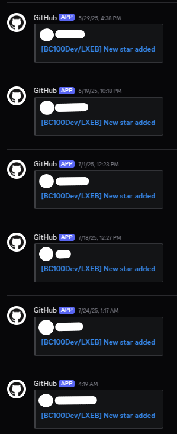

# LXEB
LXEB, as it stands for, "LinuX Exam Browser", is a Safe Exam Browser equivalent for Linux
systems. However, instead of porting the C# code into Linux equivalents, I decided to go
the lengthy route, and make it completely rewritten in C++, with Qt, and its specific Linux
counterparts.

As of now, there are no documentations, but I'll try to document the parts on what it
includes because I like documenting it to the lengths, where no one wants to even read in
the first place.

## Attention grabbed - dev resumed
Alright, you little gremlins of GitHub (no offense please). You made enough attention in the
last 2 months that I even have that little webhook on Discord that tracks things like that.
Yes, I get pinged for each star and every commit that goes in there. Basically, I enabled
everything, so that I keep up with changes. You want this thing to be completed? Alright,
I'll continue working on it, considering I literally abandoned this repo like what, 8 months
ago, since I was annoyed by literally my own school requiring me to use the school computers.
I mean, bruh, Windows being a damn Spyware OS and macOS being expensive as hell is already bad
enough, so people just switch to Linux, but considering that I abandoned this project before
and seeing that it is getting attention again is insane. Although I do have to thank you guys,
since if I were to never continue working on it, I would most likely abandon it completely
(like I even did with [aboawt](https://github.com/BC100Dev/aboawt) and
[Ansible2cxx](https://github.com/BC100Dev/ansible2cxx)). And if you guys don't believe me
that I do monitor such actions (which also involve OsintgramCXX itself), here is the evidence.
For reasons, especially the ones that are already offended and decide to remove that star,
I have decided to blur out names for their privacy sake. Obviously the profile picture too,
in case one of you assholes decide to upscale their profile pictures and perform an image
search on the web (I see you doxxers).

I'll see what I can even do to even get this thing to continue working on it, and try to 
modularize it... yes, once again, considering that I already made a flippin' template that
this thing even inherits. I won't promise that it will be completed within months, since I
don't like AI that much (I don't have trust that much into AI in completing the codebase
either way), so yeah, it might take a year or so, but I won't promise that it will be finished
soon.

And if you don't already vibe with this alone, then maybe you should stick to Windows and SEB
itself because it might not even be for you. We, as Linux users, are power users, not some...
"need help for Internet problems" kinda thing.

## Parts of the browser
- Application: The application on itself that Client and Server possibly communicates with.
- Browser: Powered with Qt, the browser itself.
- Client: the main executable for Clients
- Communication: most likely Network comms, but who tf knows
- Configuration: the default SEB configuration port
- Core: Application's main core implementation, along with the common features
- I18n: Internationalization for multilingual support
- LinuxApi: The connectors that make certain connections work with Linux
- Lockdown: yes, the lockdown feature in itself
- Logging: Logging related features
- Monitoring: Monitoring related features
- Proctoring: A library that disallows cheating during exams
- ResetUtility: An executable to reset the configurations
- Runtime: Application's Executable Runtime
- Server: Server executable that allows the hosting of SEB/LXEB servers
- Service: LXEBs Service to monitor the system with higher privileges than the
  current user running LXEB
- SystemComponents: Components related to the system configurations, including VM checks
- UserInterface: Powered with Qt, powering up the main user interface

Along with that, there is the `Installer` that you can find. It is responsible for installing,
modifying and uninstalling LXEB itself.

## Removed features
Now, if you may have browsed the Commit History itself, you may or may not have stumbled upon
a module called `ClientSheet`. It may sound innocent to the naked eye, but for the codebase
within, it was meant to be a Cheat Sheet. Now, for legal reasons, I had to remove it from the
mainline. I didn't remove it from the Commit History, but you can't either compile it either
way. Sure, you might finish it, if you even have that time, but from the commits alone, I
believe that it was only like what, 1 or 2 percent completed. However, I also have to make
sure you idiots don't exploit this browser too much, since knowing you guys, you want to
cheat, considering that people don't even want to prepare for exams (I've been there before).
I will be patching this piece of shit that I've abandoned, so that even dynamic library
loading is not rigged for exploits. Oh, and you guys know very damn well that I can't
implement modding features for this project, even though I would really love to. Why? It's a
damn exam browser, not a "do whatever the fuck you wanna do". Obviously I still have to comply
with the laws, even though they are like from the 1970s.